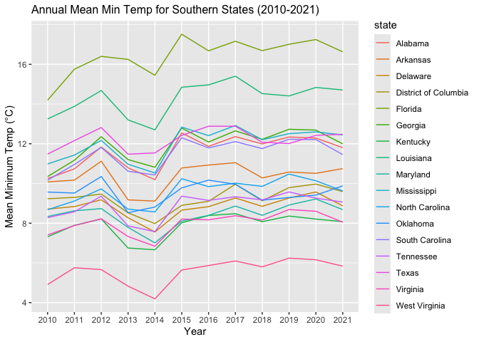
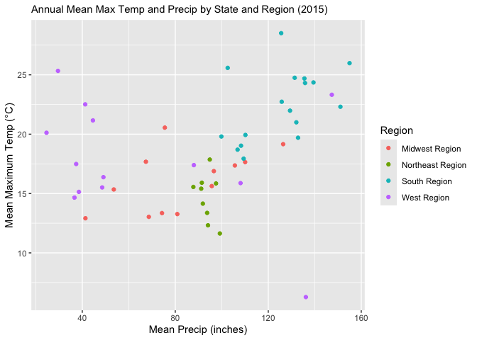
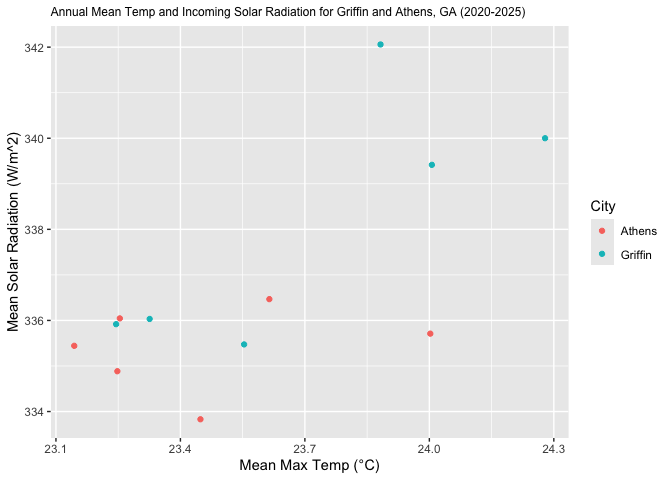

# Geog4/6300: Lab 1


## Loading data into R, data transformation, and summary statistics

**Your name: Grayson Smith**

**Overview and lab criteria:**

This lab is intended to assess your ability to use R to load data and to
generate basic descriptive statistics. For this lab to be marked
complete, the following criteria must be met:

4.  Identify and apply appropriate data filtering and cleaning
    strategies to prepare datasets for analysis. (Task 2)
5.  Effectively interpret the code you create, explaining in plain
    language what each step does to the data. (Task 6)
6.  Identify and use appropriate external documentation — including
    package references, help files, and peer resources — to learn and
    apply unfamiliar functions or methods. (Task 7)
7.  Filter, aggregate, and transform datasets using grouping and summary
    operations to answer specific analytical questions. (Tasks 1 & 5)
8.  Reshape data between wide and long formats to meet the requirements
    of different analytical or visualization tasks. (Task 4)
9.  Create effective data visualizations across multiple chart types
    (line, scatter, histogram, Q-Q plot), applying appropriate aesthetic
    choices such as color, grouping, and labeling. (Task 3 & 5)

**Data:**

You’ll be using monthly weather data from the Daymet climate database
(http://daymet.ornl.gov) for all counties in the United States over an
12-year period (2010-2021). These data are available on the GitHub repo
for our course. The following variables are provided:

- `cty_txt`: Code for joining to census data
- `year`: Year of observation (with an initial “Y” to make it a
  character)
- `month`: Month of observation (1 = Jan, 2 = Feb, etc.)
- `median_tmax`: Median maximum recorded temperature (Celsius)
- `median_tmin`: Median minimum recorded temperature (Celsius)
- `sum_prcp`: Total recorded precipitation for the month (mm)
- `cty_name`: Name of the county
- `state`: State of the county
- `region`: Census region (map:
  https://www2.census.gov/geo/pdfs/maps-data/maps/reference/us_regdiv.pdf)
- `division`: Census division
- `X`: Longitude of the county centroid
- `Y`: Latitude of the county centroid

These labs are meant to be done collaboratively, but your final
submission should demonstrate your own original thought (don’t just copy
your classmate’s work or turn in identical assignments). Your answers to
the lab questions should be typed in this Quarto template. You’ll then
render the document to a GitHub markdown document and upload it to your
class GitHub repo.

**Procedure:**

Load the tidyverse package and import the data:

``` r
library(tidyverse)

daymet_data <- read_csv("data/daymet_monthly_median_2010-2021.csv")
```

We can look at the first few rows of the dataset using the *head()*
function. We also use *kable* to format the output as a readable table..

``` r
kable(head(daymet_data))
```

| cty_txt | year | month | median_tmax | median_tmin | sum_prcp | cty_name | state | region | division | x | y |
|:---|:---|---:|---:|---:|---:|:---|:---|:---|:---|---:|---:|
| G02060 | Y2010 | 1 | -4.27 | -10.83 | 10.04 | Bristol Bay | Alaska | West Region | Pacific Division | -156.7011 | 58.74213 |
| G02185 | Y2010 | 1 | -20.73 | -28.20 | 0.00 | North Slope | Alaska | West Region | Pacific Division | -153.4411 | 69.30696 |
| G02180 | Y2010 | 1 | -16.50 | -23.72 | 5.75 | Nome | Alaska | West Region | Pacific Division | -163.9703 | 64.89492 |
| G02050 | Y2010 | 1 | -11.20 | -18.90 | 24.55 | Bethel | Alaska | West Region | Pacific Division | -159.7678 | 60.92187 |
| G02261 | Y2010 | 1 | -13.93 | -20.03 | 15.84 | Valdez-Cordova | Alaska | West Region | Pacific Division | -144.4573 | 61.57080 |
| G02170 | Y2010 | 1 | -5.10 | -12.42 | 35.84 | Matanuska-Susitna | Alaska | West Region | Pacific Division | -149.5702 | 62.31653 |

There are a lot of observations here, 452,448 to be exact. To get a
better grasp on the data, we can use `group_by()` and `summarise()` from
the tidyverse package. This will allow us to identify the mean value for
each year by county across the study period.

## Task 1

*Use `group_by()` and `summarise()` to calculate the mean minimum
temperature for each year by county across all months, also including
State and Region as grouping variables. Your resulting dataset should
show the value of tmin for each county in each year. Use the `kable()`
and `head()` functions as shown above to call the resulting table.*

``` r
# Your code goes here

grouped_daymet_data <- daymet_data %>%
  group_by(cty_name, state, region, year) %>% 
  summarise(mean_tmin_bycty = mean(median_tmin)) %>%
  mutate(year = str_remove(year,"Y"))
```

    `summarise()` has regrouped the output.
    ℹ Summaries were computed grouped by cty_name, state, region, and year.
    ℹ Output is grouped by cty_name, state, and region.
    ℹ Use `summarise(.groups = "drop_last")` to silence this message.
    ℹ Use `summarise(.by = c(cty_name, state, region, year))` for per-operation
      grouping (`?dplyr::dplyr_by`) instead.

``` r
#kable(grouped_daymet_data) #I hid this funciton because it prints out very large on the markdown document; however, I can certainly un-do this if it causes any issues. 
head(grouped_daymet_data)
```

    # A tibble: 6 × 5
    # Groups:   cty_name, state, region [1]
      cty_name  state          region       year  mean_tmin_bycty
      <chr>     <chr>          <chr>        <chr>           <dbl>
    1 Abbeville South Carolina South Region 2010            10.0 
    2 Abbeville South Carolina South Region 2011            10.5 
    3 Abbeville South Carolina South Region 2012            11.6 
    4 Abbeville South Carolina South Region 2013             9.98
    5 Abbeville South Carolina South Region 2014             9.88
    6 Abbeville South Carolina South Region 2015            11.8 

## Task 2

*Let’s shift to the state level, focusing on those in the South Region.
Filter the original data frame (`daymet_data`) to just include counties
in this region. Then calculate the mean minimum temperature by year for
each state. For an optional extra challenge, use the `round()` function
to include only 1 decimal point. Use `kable()` and `head()` to call the
first few lines of the resulting table.*

``` r
# Your code goes here

grouped_daymet_data_south <- daymet_data %>%
  filter(region=="South Region") %>%
  group_by(state, year) %>% 
  summarise(mean_tmin_bystate = mean(median_tmin)) %>%
  mutate(rounded_mean_tmin_bystate = round(mean_tmin_bystate, digits = 1)) %>%
  mutate(year = str_remove(year,"Y"))
```

    `summarise()` has regrouped the output.
    ℹ Summaries were computed grouped by state and year.
    ℹ Output is grouped by state.
    ℹ Use `summarise(.groups = "drop_last")` to silence this message.
    ℹ Use `summarise(.by = c(state, year))` for per-operation grouping
      (`?dplyr::dplyr_by`) instead.

``` r
#kable(grouped_daymet_data_south) #I hid this funciton because it prints out very large on the markdown document; however, I can certainly un-do this if it causes any issues. 
head(grouped_daymet_data_south) 
```

    # A tibble: 6 × 4
    # Groups:   state [1]
      state   year  mean_tmin_bystate rounded_mean_tmin_bystate
      <chr>   <chr>             <dbl>                     <dbl>
    1 Alabama 2010               10.2                      10.2
    2 Alabama 2011               10.7                      10.7
    3 Alabama 2012               11.8                      11.8
    4 Alabama 2013               10.8                      10.8
    5 Alabama 2014               10.2                      10.2
    6 Alabama 2015               12.5                      12.5

## Task 3

*To visualize the trends, we could use ggplot to visualize change in
mean temperature over time. Create a line plot (`geom_line`) showing the
state means you calculated in task 2. Use the `color` parameter to show
separate colors for each state. You may also need to define the state as
a group in the aesthetic parameter.*

``` r
# Your code goes here

ggplot(grouped_daymet_data_south,
       aes(x=year, 
           y=mean_tmin_bystate, group=state,
           color=state)) +
  geom_line() +
  ggtitle("Annual Mean Min Temp for Southern States (2010-2021)") +
  theme(
    plot.title = element_text(size = 12)) + #Had to do to shrink title to fit
  xlab("Year") +
  ylab("Mean Minimum Temp (\u00B0C)")
```



## Task 4

*If you wanted to look at these data as a table, you’d need to have it
in wide format. Use the `pivot_wider()` function to create a wide-format
version of the data frame you created in task 2. In this case, the rows
should be states, the columns should be the years, and the data in those
columns should be mean minimum temperatures. Then call the whole table
using `kable()`.*

``` r
# Your code goes here
wider_grouped_daymet_data_south <- grouped_daymet_data_south %>%
  group_by(state) %>%
  pivot_wider(id_cols = state, names_from= year,
              values_from= rounded_mean_tmin_bystate) #The id_cols groups everything so we have one state per row; without it, you get one row for each State-Year combo. 


kable(wider_grouped_daymet_data_south)
```

| state                | 2010 | 2011 | 2012 | 2013 | 2014 | 2015 | 2016 | 2017 | 2018 | 2019 | 2020 | 2021 |
|:---------------------|-----:|-----:|-----:|-----:|-----:|-----:|-----:|-----:|-----:|-----:|-----:|-----:|
| Alabama              | 10.2 | 10.7 | 11.8 | 10.8 | 10.2 | 12.5 | 11.9 | 12.4 | 12.0 | 12.3 | 12.3 | 11.8 |
| Arkansas             | 10.1 | 10.2 | 11.1 |  9.2 |  9.1 | 10.8 | 10.9 | 11.0 | 10.3 | 10.6 | 10.5 | 10.7 |
| Delaware             |  8.7 |  8.8 |  9.2 |  8.3 |  7.6 |  8.7 |  8.8 |  9.3 |  8.8 |  9.3 |  9.6 |  8.9 |
| District of Columbia |  9.2 |  9.3 |  9.5 |  8.5 |  8.0 |  8.9 |  9.1 | 10.0 |  9.1 |  9.8 | 10.0 |  9.6 |
| Florida              | 14.2 | 15.8 | 16.4 | 16.2 | 15.4 | 17.5 | 16.7 | 17.2 | 16.7 | 17.0 | 17.2 | 16.6 |
| Georgia              | 10.3 | 11.2 | 12.4 | 11.2 | 10.8 | 12.8 | 12.1 | 12.7 | 12.2 | 12.7 | 12.7 | 12.0 |
| Kentucky             |  7.3 |  7.9 |  8.2 |  6.7 |  6.7 |  8.0 |  8.4 |  8.5 |  8.1 |  8.4 |  8.2 |  8.1 |
| Louisiana            | 13.2 | 13.9 | 14.7 | 13.2 | 12.7 | 14.8 | 15.0 | 15.4 | 14.5 | 14.4 | 14.8 | 14.7 |
| Maryland             |  8.3 |  8.6 |  8.7 |  7.8 |  7.0 |  8.1 |  8.4 |  8.9 |  8.4 |  8.9 |  9.2 |  8.7 |
| Mississippi          | 11.0 | 11.4 | 12.2 | 11.0 | 10.5 | 12.8 | 12.4 | 12.9 | 12.2 | 12.5 | 12.6 | 12.4 |
| North Carolina       |  8.7 |  9.1 |  9.7 |  8.7 |  8.6 | 10.2 |  9.8 | 10.0 |  9.9 | 10.5 | 10.1 |  9.6 |
| Oklahoma             |  9.6 |  9.5 | 10.4 |  8.5 |  8.8 |  9.8 | 10.2 | 10.0 |  9.2 |  9.3 |  9.4 |  9.9 |
| South Carolina       | 10.2 | 11.0 | 11.8 | 10.6 | 10.4 | 12.3 | 11.8 | 12.1 | 11.8 | 12.2 | 12.2 | 11.5 |
| Tennessee            |  8.3 |  8.6 |  9.4 |  7.9 |  7.6 |  9.4 |  9.1 |  9.3 |  9.2 |  9.6 |  9.3 |  9.1 |
| Texas                | 11.5 | 12.2 | 12.8 | 11.5 | 11.5 | 12.4 | 12.9 | 12.9 | 12.1 | 12.0 | 12.4 | 12.5 |
| Virginia             |  7.4 |  7.9 |  8.2 |  7.3 |  6.8 |  8.2 |  8.2 |  8.4 |  8.2 |  8.7 |  8.6 |  8.1 |
| West Virginia        |  4.9 |  5.8 |  5.7 |  4.8 |  4.2 |  5.6 |  5.9 |  6.1 |  5.8 |  6.2 |  6.2 |  5.8 |

## Task 5

*Let’s assess the relationship of heat and precipitation by region.
Returning to the original dataset, create a data frame that shows the
mean maximum temperature and mean precipitation for all states in 2015,
also including region as a subgroup in your `group_by`. Then use ggplot
to create a scatterplot (`geom_point`) for these two variables, coloring
the points using the region variable.*

``` r
# Your code goes here
grouped_daymet_data_region_2015 <- daymet_data %>%
  filter(year == "Y2015") %>%
  group_by(state, region, year) %>% 
  summarise(mean_tmax_bystate = mean(median_tmax), mean_sumprcp_bystate = mean(sum_prcp)) %>%
  mutate(year = str_remove(year,"Y"))
```

    `summarise()` has regrouped the output.
    ℹ Summaries were computed grouped by state, region, and year.
    ℹ Output is grouped by state and region.
    ℹ Use `summarise(.groups = "drop_last")` to silence this message.
    ℹ Use `summarise(.by = c(state, region, year))` for per-operation grouping
      (`?dplyr::dplyr_by`) instead.

``` r
#kable(grouped_daymet_data_region)

#Making the plot itself
ggplot(grouped_daymet_data_region_2015,
       aes(x=mean_sumprcp_bystate, 
           y=mean_tmax_bystate,
           color=region)) +
  geom_point() +
  ggtitle("Annual Mean Max Temp and Precip by State and Region (2015)") +
  theme(
    plot.title = element_text(size = 11)) +
  xlab("Mean Precip (inches)") +
  ylab("Mean Maximum Temp (\u00B0C)") +
  labs(color = "Region") #Had to do this to capitilize "region" in the legend. 
```



## Task 6

*In the space below, explain what each function in your code for task 5
does to the dataset in plain English.*

Task 6 Response: The first part of Task 5 – the data manipulation
portion – begins by creating a new variable
(grouped_daymet_data_region_2015). From there, the original dataset
(daymet_data) is then passed through a series of functions, starting
with a filter that only takes out rows for the year 2015. From there,
the data is then grouped according to its state, region, and year (in
that order). Using those groupings, the function then takes the mean of
the median_tmax and total precipitation for each state in 2015 (the “per
state” nature of the data is likely a result of state being the first
subgroup by which the data is grouped) and displays those mean values as
new columns (with the titles mean_tmax_bystate and
mean_sumprcp_bystate). Finally, the data is manipulated to remove the
“Y” in front of all the year numbers, just to allow for a more appealing
plot (as described below).

The code then turns to making a scatter plot using these new mean values
for median_tmax and sumprcp (i.e., the mean of the median max
temperature and summed precip per state, in 2015). The function starts
by referencing the grouped_daymet_data_region_2015 dataset (the data we
just manipulated, as described above), then assigns the x and y axes to
the mean precip and mean median max temps, respectively. It then colors
the respective by-state value for precip and mean max temp (i.e., the
point at the “coordinate” pair formed between the precip and temp data
for each state) by region (allowing us to see many clear regional trends
in temp and precip distribution). From there, the remainder of the code
aims to add various titles to the plot itself, its axes, and the legend,
all to make the figure more usable and visually appealing.

## Task 7

*The `dplyr` package also includes `across` function. Use `?across` on
the R command line to open the documentation for this function. In the
space below, explain what it does in your own words. Then interpret the
way the across function is used below, going line by line within the
function.*

``` r
state_2015 <- daymet_data %>%
  filter(year == "Y2015") %>%
  group_by(region, state) %>%
  summarise(
    across(
      c(median_tmax, sum_prcp),
      mean,
      na.rm = TRUE,
      .names = "mean_{.col}"
    )
  )
```

    Warning: There was 1 warning in `summarise()`.
    ℹ In argument: `across(c(median_tmax, sum_prcp), mean, na.rm = TRUE, .names =
      "mean_{.col}")`.
    ℹ In group 1: `region = "Midwest Region"`, `state = "Illinois"`.
    Caused by warning:
    ! The `...` argument of `across()` is deprecated as of dplyr 1.1.0.
    Supply arguments directly to `.fns` through an anonymous function instead.

      # Previously
      across(a:b, mean, na.rm = TRUE)

      # Now
      across(a:b, \(x) mean(x, na.rm = TRUE))

    `summarise()` has regrouped the output.
    ℹ Summaries were computed grouped by region and state.
    ℹ Output is grouped by region.
    ℹ Use `summarise(.groups = "drop_last")` to silence this message.
    ℹ Use `summarise(.by = c(region, state))` for per-operation grouping
      (`?dplyr::dplyr_by`) instead.

Task 7 Response: It appears that the `across` function can be used to
apply another function – like `summarise` function – across multiple
columns. Using this `across` function should preclude having to do
multiple `summarise` functions for different columns – or at the very
least, make the syntax within one`summarise` function more streamlined
(as it appears it also possible to apply `summarise` to multiple columns
without `across,` it is just far longer syntax). In the code given
above, the `across` is used to first take the mean of the values in the
median_tmax and sum_prcp, then to remove any N/A values from both of
those columns, and finally to name the resultant columns (with the mean
values) according to the convention of mean\_“previous column name”
(i.e., mean_median_tmax). The use of across here just make ts the synatx
more straightforward to handle each of those tasks across these two
columns without needing two `summarise` functions (or a more complex
single `summarise`).

## Challenge Question

In class, we covered ways of working with the Daymet API. Create a
script below that uses the **daymetr** package to download data from
Daymet for a place (or places) of your choosing. Then visualize the
temporal pattern for a variable of your choosing in this place, similar
to what you did in question 4. Use a dplyr function (`mutate()`,
`summarise()`, `filter()`, etc.) to do any needed data wrangling and
create a visual using ggplot.

In addition to this code, write a short summary of a pattern that’s
evident in the data you visualized.

``` r
# Your code goes here
library(daymetr)

griffin_daymet <- download_daymet(site="griffin",lat=33.2476,lon=-84.2709,start=2020,end=2025,internal=TRUE) #This is my hometown!
```

    Downloading DAYMET data for: griffin at 33.2476/-84.2709 latitude/longitude !

    Done !

``` r
athens_daymet <- download_daymet(site="athens",lat=33.9498,lon=-83.3734,start=2020,end=2025,internal=TRUE)
```

    Downloading DAYMET data for: athens at 33.9498/-83.3734 latitude/longitude !

    Done !

``` r
griffin_df <- as.data.frame(griffin_daymet$data)
athens_df <- as.data.frame(athens_daymet$data)

daymet_data_griffin_yearlytemp_srad <- griffin_df %>%
  filter(tmax..deg.c. > -10, srad..W.m.2. > 0) %>%
  group_by(year) %>%
  summarise(mean_tmax = mean(tmax..deg.c.),mean_srad = mean(srad..W.m.2.)) %>%
  mutate(year = str_remove(year,"Y"),city="Griffin")
#kable(daymet_data_griffin_yearlytemp_srad)

daymet_data_athens_yearlytemp_srad <- athens_df %>%
  filter(tmax..deg.c. > -10, srad..W.m.2. > 0) %>%
  group_by(year) %>%
  summarise(mean_tmax = mean(tmax..deg.c.),mean_srad = mean(srad..W.m.2.)) %>%
  mutate(year = str_remove(year,"Y"),city = "Athens")
#kable(daymet_data_athens_yearlytemp_srad)

combined_griffin_athens_df <- full_join(daymet_data_griffin_yearlytemp_srad,daymet_data_athens_yearlytemp_srad) #Added this because I could not find out a way to plot the data if it was in two separate data frames. That should be investigated for future labs. 
```

    Joining with `by = join_by(year, mean_tmax, mean_srad, city)`

``` r
#Making the plot itself
ggplot(combined_griffin_athens_df,
       aes(x=mean_tmax, 
           y=mean_srad, group=city,
           color=city)) +
  geom_point() +
  ggtitle("Annual Mean Temp and Incoming Solar Radiation for Griffin and Athens, GA (2020-2025)") +
  theme(
    plot.title = element_text(size = 9)) + #Had to do to shrink title to fit
  xlab("Mean Max Temp (\u00B0C)") +
  ylab("Mean Solar Radiation (W/m^2)") +
  labs(color = "City")
```



Challenge Task Response: There are two primary patterns I notice in this
(albeit similar) scatterplot comparing the max temp and incoming solar
radiation for Athens and Griffin, GA. The first of these patterns is
that mean max temp tends to (but does not always) closely follow mean
solar radiaiton received at the surface. This relationship is very
intuitive and expected, as days (months and years) that receive more
solar insolation at the surface will likely warm up more than days with
less solar enegy reaching the surface. Conversely, there are some
notable exceptions to this, especially in the case of the 2024 data for
Athens (the year with a mean solar radiation just under 336 W/m^2 and an
average mean max temp of near 24 deg C), where a relatively lower
average solar insolation has a relatively high average max temp. This
indicates that, as is also rather intuitive, other factors include
temperature than just solar radiation received at the surface. This
particular observation is important for explaining numerous
weather/climate phenomena, including the idea that the planet can warm
even when solar isolation (even that received at the top of the
atmosphere) stays the same or decreases, as there are countless other
factors that influence surface temperature (including cliamte factors
like greenhouse gases or weather features like warm air advection or
consistent high pressure systems). Together, these two patterns describe
the two sides of the solar radiation-temperature “coin,” specifically
that (especially daytime max) temperature is strongly driven by the
amount of solar energy received at the surface, but that solar isolation
alone is not solely responsible for temperature variations (and thus
countless other factors must be considered). Concerning patterns that
might exist between Athens and Griffin, it did not appear there were too
many meaningful differences, aside from Athens generally being a bit
cooler. The causes for this are a bit unclear, although they could
include features like Cold Air Damming (the “wedge”), closer proximity
to cooler air from higher latitudes (although that should be minimal
given the relatively small difference in latitude between the two
locations), or numerous other factors that would be difficult to
ascertain from a simple plot like this one.

## Final Submission Stuff

### Disclosure of Assistance

Besides class materials, what other sources of assistance did you use
while completing this lab? These can include input from classmates,
relevant material identified through web searches (e.g., Stack
Overflow), or assistance from ChatGPT or other AI tools. How did these
sources support your own learning in completing this lab?

The two primary resources I used during the completion of this lab
included brief comments from my classmates and some use of Google
Gemini. In terms of my interaction with my classmates, I
cross-referenced my work (especially for Task 1) with Will to ensure
that my answer was reasonable – allowing me to gain confidence that my
strategy for that task was appropriate (and thus allowing me to
hopefully remember that strategy for similar tasks in the future
\[including using Task 1 as a template for much of the group_by and
summarise functions done in later lab tasks\]). In terms of my use of
Google Gemini, I used this tool to get ideas for strategies to
troubleshoot my code (without asking for the specific code itself to
ensure I wrote the code presented above), especially in areas where the
strategies I remembered from class were not producing the reuslt I
expected (likely just due to my lacking knowledge). This was especially
true in both my inclusion of the “theme” function in many of my plots (a
strategy I had to seek out to decrease the size of my overly-long plot
titles) and the use of the “id_cols” function in the `pivot_wider`
function in Task 4 (which I needed to ensure I got only one result for
each state, rather than multiple results \[for each year\] from the same
state). In both cases, Gemini was able to provide advice on what
strategies to use to solve my persistent issue, strategies that I then
implemented and now intend to use on future tasks. As such, Gemini aided
(as with last lab) in deepening my knowledge of different R
functionalities – all of which I hope to retain to solve increasingly
complex tasks in future labs. Together, both my collaboration with Will
and my use of Gemini aided in my learning here by allowing me to more
quickly solve many of my problems while still exposing me to additional
R functionalities that I can now use in my future R adventures.

### Lab Reflection

How do you feel about the work you did on this lab? Was it easy,
moderate, or hard? What are the biggest things you learned by completing
it?

Similar to Lab 0, I found the work for this lab of moderate difficulty.
However, unlike Lab 0, I did think I was able to troubleshoot basic
problems more efficiently (such as missing pipes or pluses in plotting
chunks) and instead struggled more on slightly more complex issues like
those described in the Disclosure of Assistance above (i.e., those I
received strategies from Gemini for).

Concerning the biggest things I learned in this lab, I thought my
biggest takeaway was how to wrangle data using more complex combinations
of `summarise`, `mutate`, and `filter` (including across multiple
columns, using either my heavier-syntax version or the much more
streamlined `across` function) to draw conclusions and create new values
from dataframes. Further, I also got better experienced with making (at
least hopefully) more visually appealing plots by adding titles and
other peripheral elements, and with converting lists to dataframes (and
further manipulating them from there) through my work on the challenge
question. Altogether, I thought that this lab certainly further
contributed to building a strong foundation on data handling and
manipulation that I hope to continue building on in future R work.
